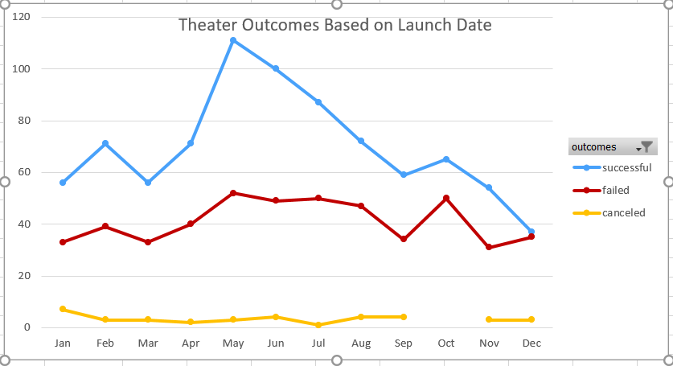
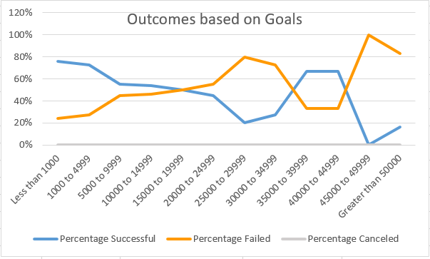

# Kickstarting with Excel

## Overview of Project

The overall summary is to have successful fundraising campain for Louise's play.

### Purpose

The purpose of this project is to visualize how campaigns fared based on funding goals and launch date from theatre and play related campaigns information on kickstarter analysis data.

## Analysis and Challenges

The analysis is based on kickstarter sample data. To limit the sample data filters applied on theater and play related  campaings which is main point of interest. Also filtered out any live events as the outcome of these play's can't be determined until they are ended. The main challenge with the data is to convert the timestamp fields to determine the actual dates for the campaings. The challenges related to outliers got eliminated once data limited to Theatres and plays. The additional tabs that are created to show details based on ***'Outcomes based on Launch date'*** and ***'Outcomes Based on Goals'***.

### Analysis of Outcomes Based on Launch Date

From kickstarter data additional filters applied to limit the data based on parent category  for *'Theatre'*.  The pivot table shows the count of sucessful, failed and canceled outcomes based on month of campaign launch dates. The same data represented through chart as well as shown in below picture.

### Analysis of Outcomes Based on Goals

From kickstarter analysis data additional filters applied based on parent category *'Theatre'* and subcategory *'Goals'*. As the goals are spread across multiple values a new category created based on the goal amount range with interval of $5000 as shown in tab 'Outcomes Based on Goals'. For each of this range the outcome percentages are calculated and shown in a table. The same percentages are represented on graph as shown below.

### Challenges and Difficulties Encountered

Once the data filtered to Theater and Plays there is no sample for Canceled. As you see in Outcomes based on Goals chart the canceled line is flat line on x-axis. 

## Results

The two conclusions you can draw about the Outcomes based on Launch Date are as below.

1. Most sucessful fundraising campains started during month of May and June.
2. The failed fundraising campaigns are almost equal to sucessful fundraising campaigns during month of December and so the month of Decemeber is least favorable to begin the fundraising campaign.

What can you conclude about the Outcomes based on Goals?

1. The fundraising goals for less than $5000 likely be most sucessful.

What are some limitations of this dataset?

1. The sample data is very limited to GB and so considering for all countries. Also for Theatre and Play there isn't much data for goals that are greater than $20,000.

What are some other possible tables and/or graphs that we could create?

1. Similar tables/graphs can be created based on fundraising campaign end dates.
2. Also create number of campaign days will help to determine how long campaign should run to be sucessful.
